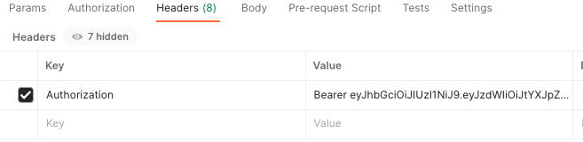

# Family Time Beverages API
[](https://opensource.org/licenses/MIT)

## Description
The Family Time Beverage API will allow registered users the ability to maintain their beverages grouped in their own beverage types.  This fully functioning C(reate)R(ead)U(pdate}D(elete) API will provide registered users the ability to track all their beverages safely and securely. 

# Table of Contents

- [Installation](#installation)
- [Usage](#usage)
- [Credits](#credits)
- [License](#license)
- [Questions](#questions)
- [Credits](#credits)
- [Contributing](#contributing)
- [Test](#test)

## Installation
1.  Clone the repository.
1.  Ensure you are using JDK 17, Spring Boot 2.7.8 and Maven 4.x 
1.  Using IntelliJ IDEA, open the pom.xml and ensure all necessary dependencies have been installed.
1.  To run the project, navigate to the FamilyTimeBeveragesApiApplication under /src/main/java/com.averywanda.beverageapi/ and right-click the file and choose run FamilyTieBeverageApiApplication from the popup menu.  Or you can double-click on the file to open it and click the 'Run' option (green caret).
1.  Once the application is running you should see something like this:
```
   2023-04-30 12:48:03.906  INFO 71465 --- [           main] o.apache.catalina.core.StandardService   : Starting service [Tomcat]
   2023-04-30 12:48:03.906  INFO 71465 --- [           main] org.apache.catalina.core.StandardEngine  : Starting Servlet engine: [Apache Tomcat/9.0.71]
   2023-04-30 12:48:03.940  INFO 71465 --- [           main] o.a.c.c.C.[Tomcat].[localhost].[/]       : Initializing Spring embedded WebApplicationContext
   ```

## Usage
Using an API platform like Postman, as a registered user, you can call all operational endpoints of the Family Time Beverage API (FTBA) which are available on port 9092.  An unregistered user can only access the register and login endpoints as follows:
```
-- To Register:
localhost:9092/auth/users/register/

{
    "userName" : "jane",
    "email": "jane@aol.com",
    "password": "jane"
}
-- To Login:
localhost:9092/auth/users/login/

{
    "email":"jane@aol.com",
    "password":"jane"
}
```
Once the registered user logs in, a JWT will be returned which will be needed to access all the other endpoints.  The JWT will need to be added to every request/endpoint headers section with 'Authorization' as a Key and the Value will need to be Bear [JWT] as follows:



## Credits
     DL Avery                
     Marie Simien                

## Contributing
Any contributing suggestion(s) or bug notification(s) is greatly appreciated.  Reporting
any bug can be submitted via email, see Questions section below for contact information.  
Please put [Bug Report] in the subject section of the email.  Within the email, please
provide details of the bug(s) being reported.  All email correspondences will be replied
back to within a timely manner.  For feature suggestions, please fork the repo and create
a pull request.  Thanks.

1.  Fork the project/repo into your own GitHub account and create a local clone.
1.  Create your feature branch (git checkout -b yourfeaturefolder/YourFeaturName)
1.  Commit your changes (git commit -m 'Add your comment here regarding your feature).
1.  Push to the branch (git push origin yourfeaturefolder/YourFeaturName).
1.  Open a pull request, which will be responded to in a timely manner.

## License
[MIT License](https://opensource.org/licenses/MIT) A short and simple permissive license with conditions only requiring preservation of
copyright and license notices. Licensed works, modifications, and larger works may be distributed under different
terms and without source code.

## Questions
Send all questions/comments to:
| GitHub: wmsimien https://github.com/wmsimien                                  
|--------------------------------------------------------------------------------
| Email:  wanda.avery@att.net

## Test
Testing of this application is a success when you are able to complete the installation steps and enjoy the application as described.
